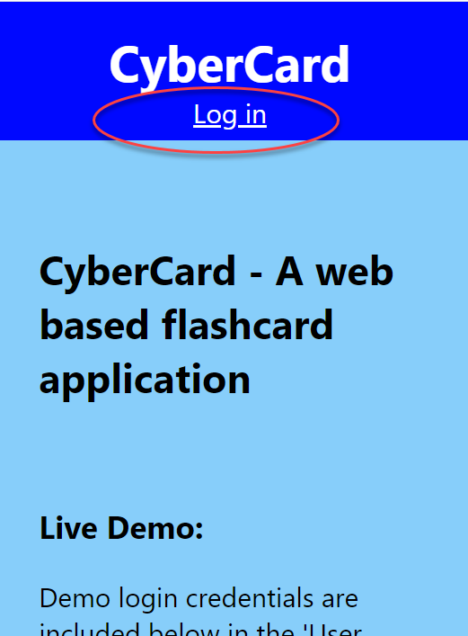
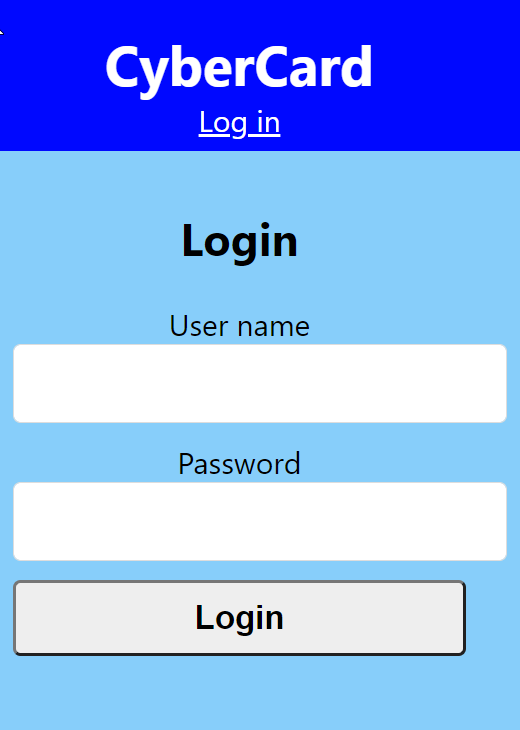
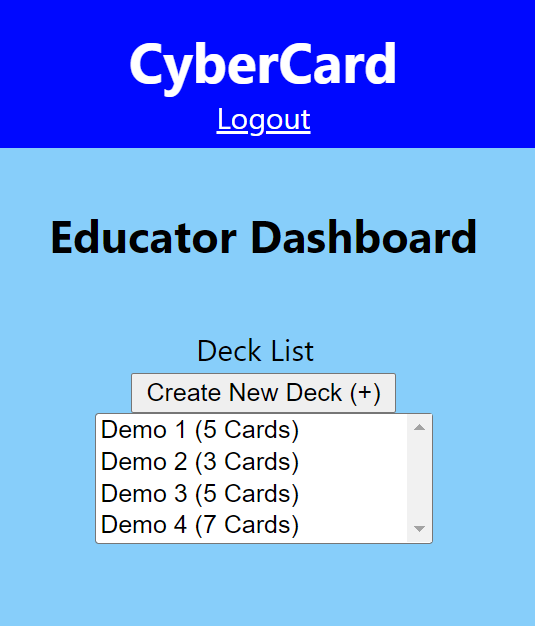
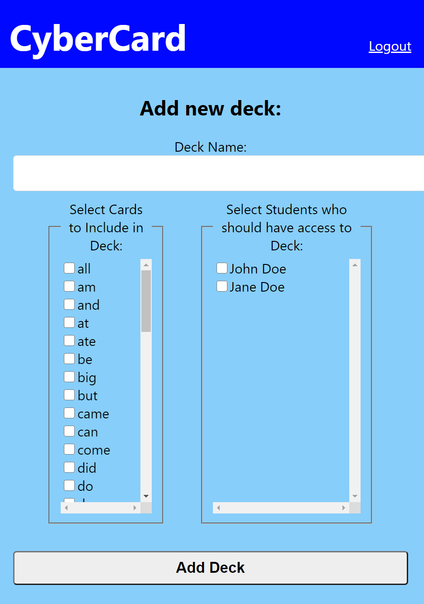
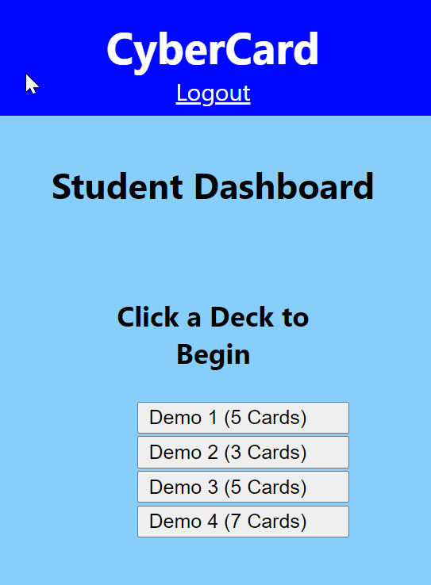
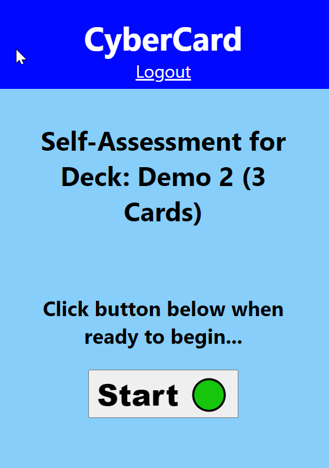
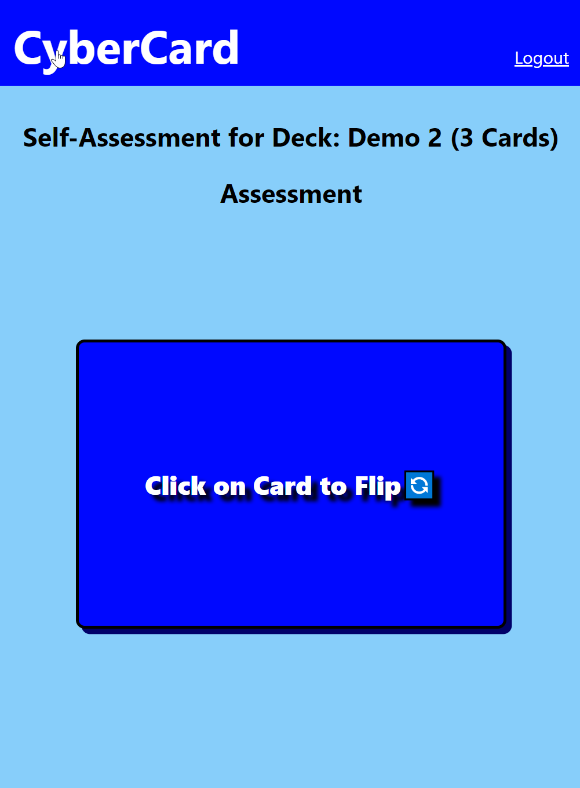
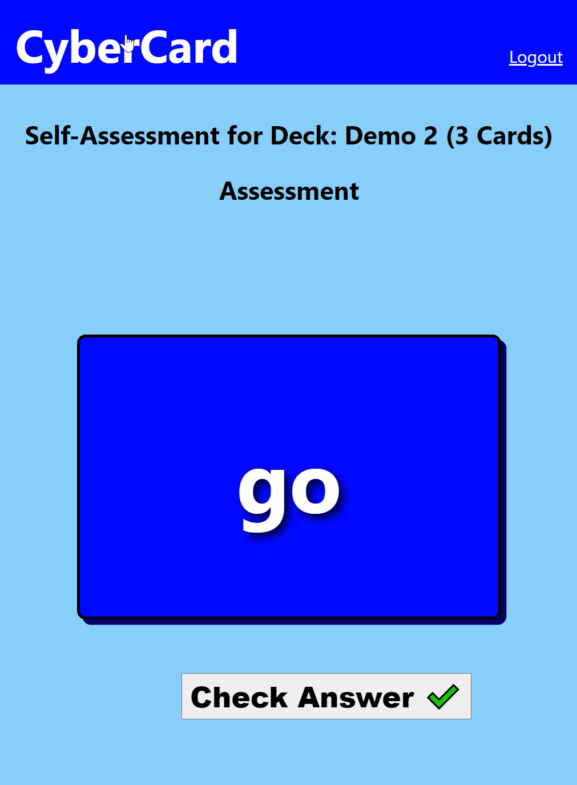
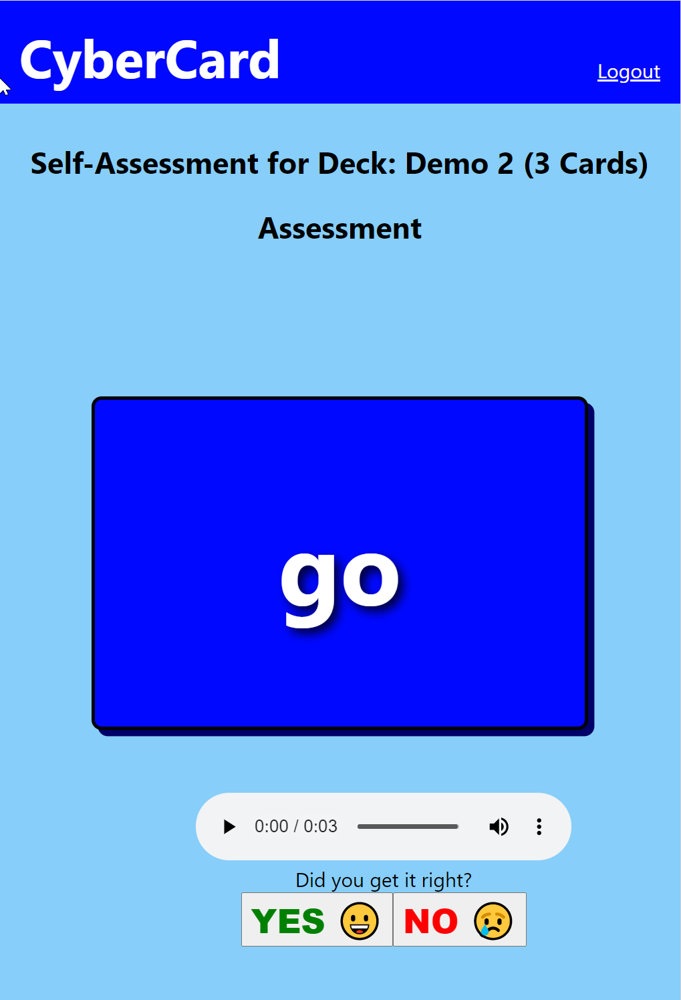
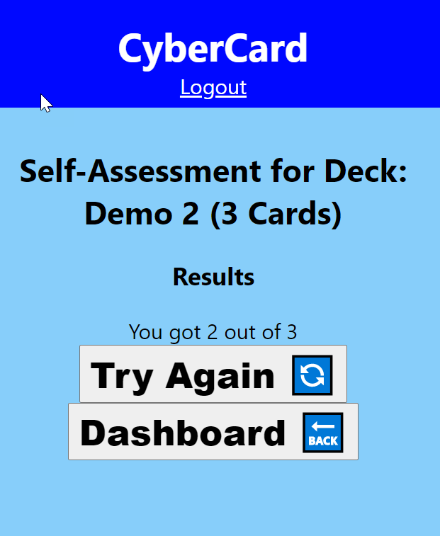

# CyberCard

## Client

This repo is client side of the CyberCard application. **NOTE: Requires API Server**: A running instance of the CyberCard API Server is required for client applicaion to function.

## Deployment

- Live demo client running on <https://cybercard.vercel.app>

- Live deployment of the API server being called by this demo is running at <https://dry-scrubland-36737.herokuapp.com>

## Summary

CyberCard is an online flashcard app. The demo is for early reader "sight words", but this could be used for math problems, music rythym patterns, or any other subject matter where short answer formats are appropriate.

The Landing Page is for demo purposes and contains basic instructions for demo accounts. All screens , including the Landing Page have a 'Login' or 'Logout' link at the top (see screenshot).

Click Login to begin demo and you can Logout at anytime to end your session and/or log in as a new user with a different role.

There is no user registration because the education institution admin/registrars would preload user accounts. Users have one of two roles, either Educator or Student

Each role has access to different functionality within the app.

**Educator**

**Demo Educator Login:** Username: **mrssmith** Password: **mrssmith**

Educators will see a read-only list of decks and a button to create a new Deck.

Educators will create new Decks by providing a unique Deck name then selecting specific cards that will make up the deck from the pre-existing card pool, and selecting which Student users should have access to the Deck.

**Student**

**Demo Student Login:** Username: **plainjane** Password: **plainjane**

Students can select a Deck they have been granted access to to do a self-assessment for formative stage learning.

They will be taken to an Assessment launch page where they will need to click the start button to begin the assessment.

The Assessment will cycle through all cards. Cards will be initially presented face down.

The Student will click the card to "flip" it face up and try to formulate an answer.

The Student will then check their work against the pre-recorded audio of the correct answer by pressing play, and will check whether they arrived at the correct answer.

Selecting either "yes" or "no" will advance to the next Facedown card and the entire process continues. After answering the last card, a summary will show the number correct for the previous deck assessment and students can "Try Again" which will restart the current Deck or return to their Dashboard to select a different Deck.

## Tech

The client side of this application is built using React in additional to standard JavaScript, HTML, and CSS, and makes RESTful API calls to access backend.
